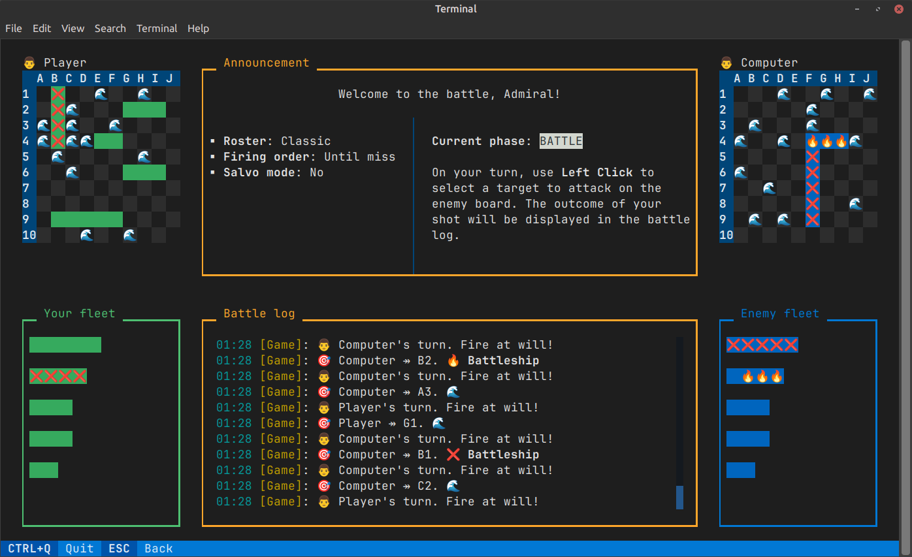
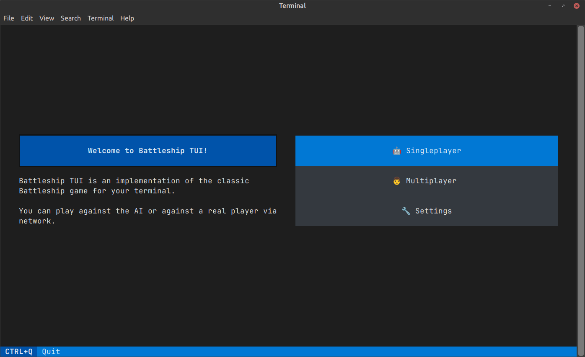
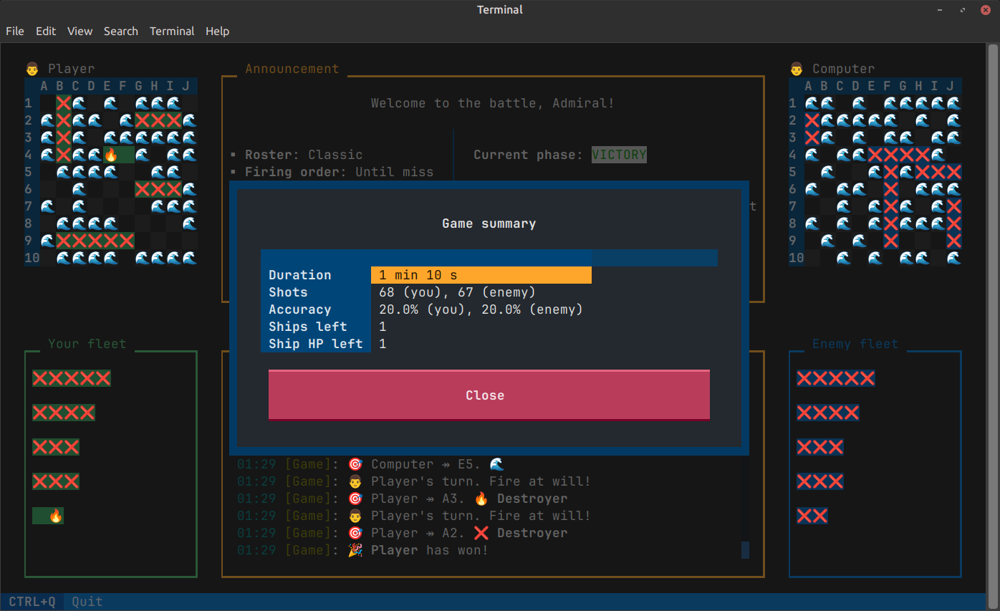
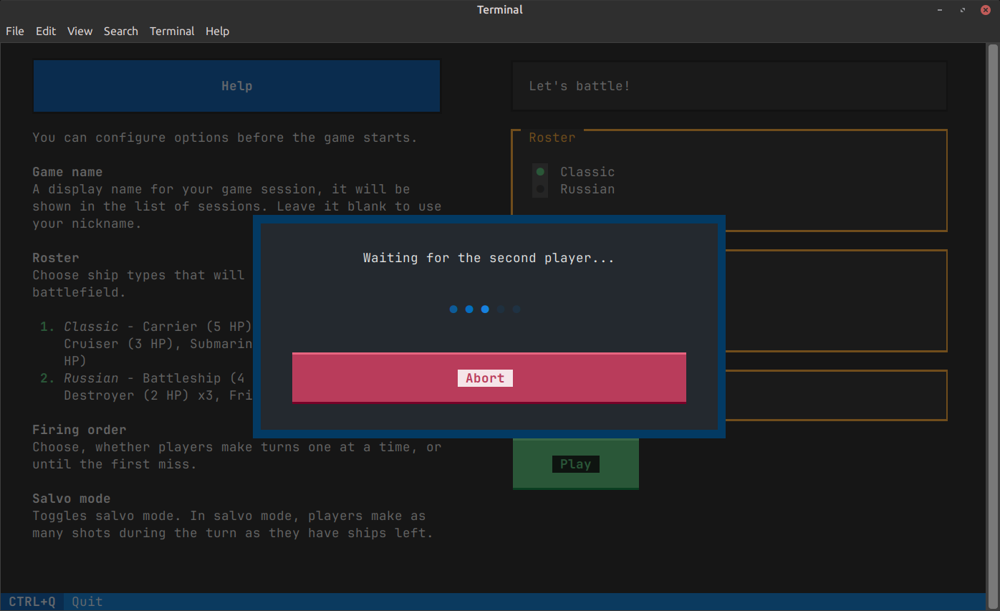
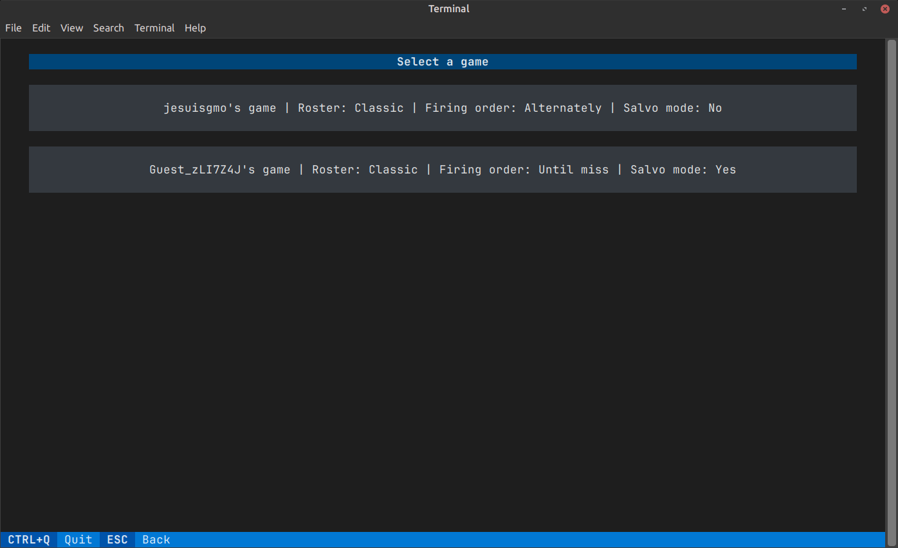

[](https://pypi.org/project/battleship-tui)

[](https://uptime.klavionik.dev/status/battleship)

# Battleship TUI
Battleship TUI is an implementation of the popular paper-and-pen Battleship game for 
your terminal. You can play against the computer or a real player via the Internet, 
customize game options and appearance, keep track of your achievements, and more.

## Features
* Singleplayer mode  
* Multiplayer mode (via Internet)
* Customizable game rules
* Customizable UI
* Launch via CLI
* Game statistics

## Planned features
* Ranking system
* Account management

## Requirements
* A terminal (Windows PowerShell is fine too, see below)
* Python 3.10 or higher

> [!NOTE]
> If you're on Windows, **make sure** to install [the newer Windows Terminal](https://apps.microsoft.com/detail/9N0DX20HK701?hl=en-us&gl=US). 
> The older Windows PowerShell can't properly display some symbols. 

## Installation
If you're on Linux or macOS, most probably you already have Python installed. You can verify it by 
running `$ python --version`. If your Python version is lower than required, try installing the 
latest operating system updates.

If you're on Windows, you can download and install the latest Python release from the 
[official site](https://www.python.org/downloads/windows/).

The recommended way to install and update the game is via 
[pipx](https://pypa.github.io/pipx/) (especially if you don't know anything about 
virtual environments).

Install `pipx`, then install the game.

```shell
pipx install battleship-tui[client]
```

`battleship-tui` is merely a Python package and is distributed via PyPI. You can 
install it via `pip` too, but make sure it installs into a venv so that you're not 
messing with the system interpreter.

## Play
Once the game is installed you can use the `battleship` command to run it. This 
command will launch the user interface and present you with the main menu.

### Play via CLI
You can launch the game via CLI subcommands too, especially if you want to skip some 
in-game menus.

For example, if your favorite game mode is singleplayer, salvo variant, you can 
quickly get into battle by running `battleship play single --salvo`.

Run `battleship play --help` to discover available options.

## Multiplayer
You can play Battleship TUI with your friends or colleagues via the Internet. Choose 
**Multiplayer** option in the main menu to do this.

### Game account
You may sign up for a multiplayer account or try multiplayer with guest access.

To sign up, run `battleship account signup`. You'll be prompted with your email, 
desired nickname, and a password. Your nickname will be displayed in-game. It should 
contain 7 to 20 characters and be unique. Your password should contain at least 9 
characters.

> [!NOTE]
> Guests given an autogenerated nickname, their game statistics isn't saved. Guest 
> access will work until you log off.


## Screenshots
<details>
<summary>Expand to see more screenshots</summary>

### Main menu


### Game summary


### Starting a multiplayer session


### List of game sessions to join

</details>
